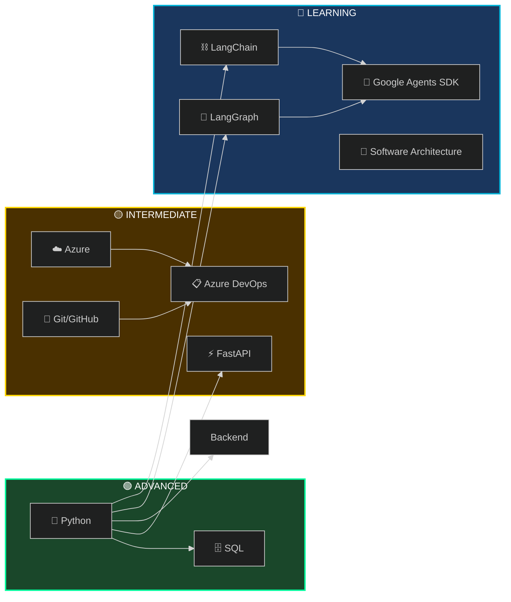

  

  

    
    
    
  

---

### 👨‍💻 About Me

I am a **Quality** and **BI Data Analyst** from **Brazil**, with **5 years of hands-on experience** in Quality, Projects, ERP, Python and data manipulation. Currently working in the **Business Strategy**, where I design and implement automation solutions, agile methodologies and full-stack applications that drive measurable and strategy business impact.

**Professional Achievements:**

- 🚀 Designed automation workflows that reduced manual effort by **200+ man-hours per month** (documented and validated)
- 💻 Architected and deployed a **production-grade web application** used company-wide to manage SAP order corrections across **5 distributors nationwide**
- 🔗 Integrated multiple enterprise databases and Microsoft APIs with strong emphasis on **backend architecture and data processing**

**Current Learning Path:**

- 📐 Dedicating over a year to deepening my knowledge in **Software Architecture** and system design
- 🤖 Exploring **AI Agent architectures** with **Google Agents SDK**, LangGraph, and LangChain

**Work Environment:**

- ⚙️ Microsoft & Azure ecosystem

> *Committed to continuous improvement—transitioning from Data Engineering toward Software Architecture and AI, while applying solid backend fundamentals to build scalable, intelligent systems.*

---

### 🛠️ Technical Arsenal

<b>📊 Skill Levels Breakdown</b>

 

| Level | Technologies | Experience |
|:-----:|--------------|------------|
| 🟢 **Advanced** | Python, SQL | 5 years |
| 🟡 **Intermediate** | Azure, Azure DevOps, Git | 2 years |
| 🔵 **Learning** | LangGraph, Google Agents SDK, LangChain, Software Architecture | 1 year |

<b>🔧 Tools & Ecosystem</b>

 

| Category | Stack |
|----------|-------|
| **Backend** | Python, FastAPI, SQL (PostgreSQL, Oracle, SQLite) |
| **Data** | Pandas, Data Manipulation, API Integrations |
| **DevOps** | Docker, Azure DevOps, Git, GitHub Actions |
| **Cloud** | Microsoft Azure |
| **AI/Agents** | Google Agents SDK, LangGraph, LangChain |
| **Methods** | Scrum, Kanban, Code Review |

---

### 🚀 Featured Projects

#### 

> *Production-Grade AI Agent System with Full-Stack Architecture*

**Highlights:**

- 🧠 **3 Specialized Agents** with MCP integrations

---

### 💼 Professional Experience

<table>
<tr>
<td width="100" align="center">

</td>
<td>
<h4>Business Strategy Performance — Data & Automation</h4>
<ul>
<li>🚀 Automation workflows saving <strong>200+ man-hours/month</strong></li>
<li>💻 Data BI (<strong>5 distributors</strong>)</li>
<li>🔗 Enterprise database and Microsoft API integrations</li>
<li>📋 Azure DevOps with Scrum/Kanban in 3-person team</li>
</ul>
</td>
</tr>
</table>

---

  

